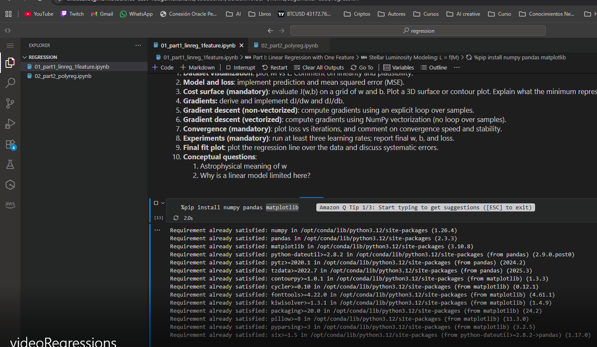
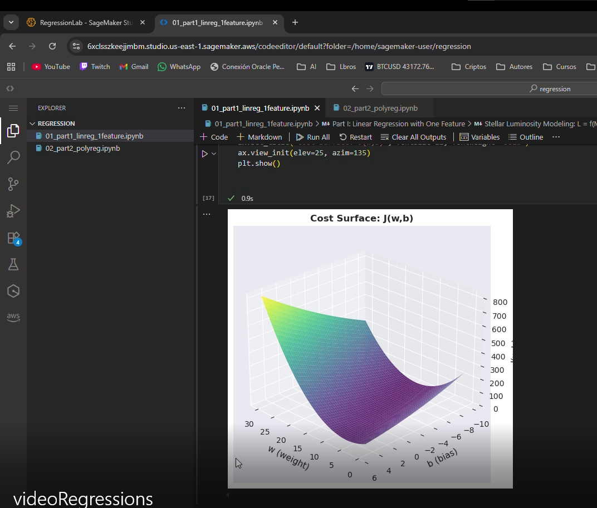
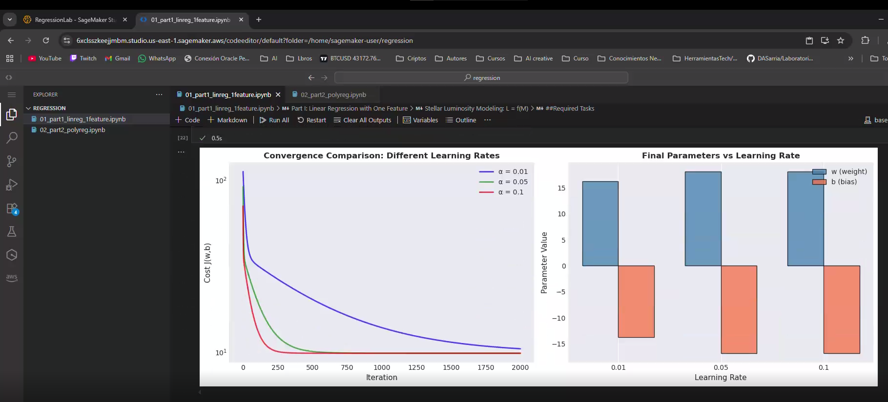
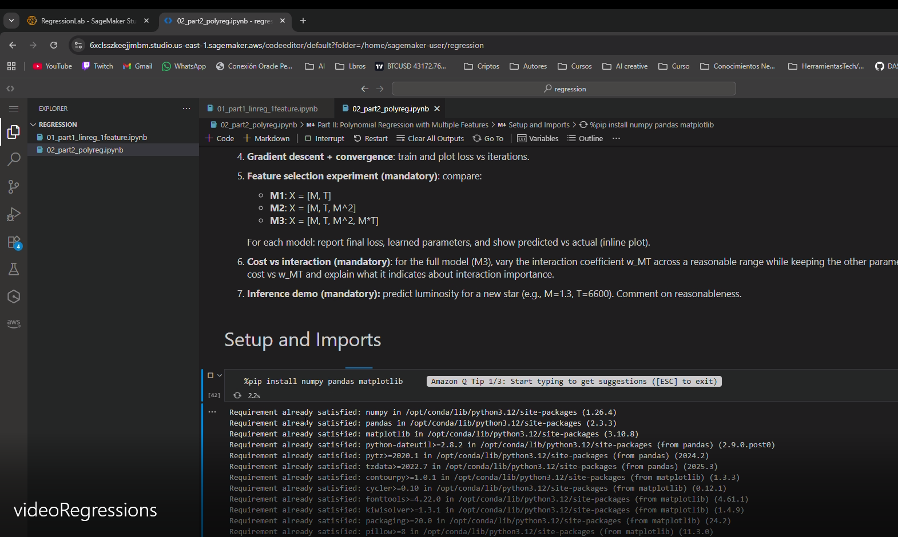
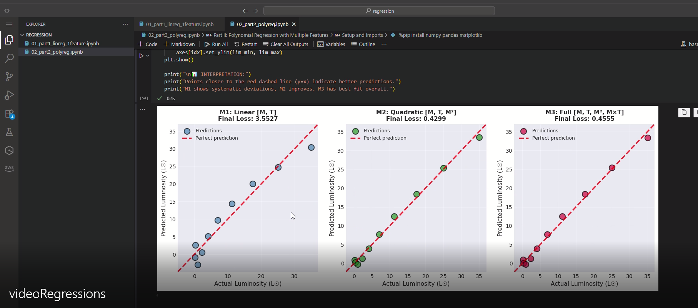
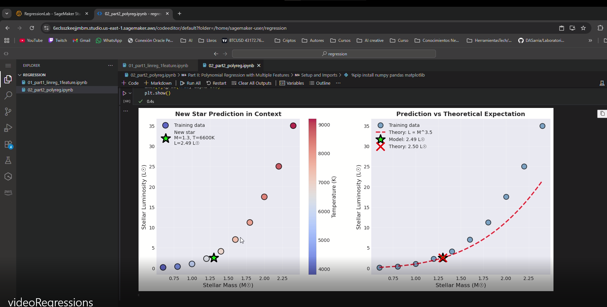

# Stellar Luminosity Regression: From First Principles

## Introduction and Motivation

Astronomy is a data-driven science in which relationships between physical quantities are inferred and validated through observation. Classical examples include the relationships between stellar mass, temperature, radius, and luminosity. In this homework, you will implement linear regression and polynomial regression from first principles, without using machine-learning libraries.

Rather than calling pre-built fitting routines, you will explicitly define the hypothesis function, the loss function, and the optimization algorithm. The astronomical problem studied here is a simplified stellar luminosity modeling task, inspired by main-sequence behavior: luminosity grows rapidly with mass, and additional properties can introduce nonlinear and interaction effects.

## Motivation for Cloud Execution and Enterprise Context
This homework is part of a four-week Machine Learning Bootcamp embedded in a course on Digital Transformation and Enterprise Architecture. In this context, machine learning is treated as a core architectural capability of modern enterprise systems.

Today, intelligence is increasingly considered a first-class quality attribute alongside scalability, availability, security, and performance. Intelligent behavior is no longer confined to offline analytics; it is embedded into platforms, decision-support services, and autonomous or semi-autonomous components.

As enterprise architects, it is not sufficient to understand what models do. We must also understand how they are built from first principles, executed and validated in controlled environments, and operated within cloud platforms.

## General Rules and Delivery Requirements

1. Deliver all work in a single GitHub repository.
2. The repository must contain two Jupyter notebooks and one README.md.
3. All code must be written inside the notebooks.
4. All datasets must be defined directly in the notebooks (as hard-coded NumPy arrays).
5. Allowed libraries: Python, NumPy, Matplotlib (inline plots only).
6. Not allowed: scikit-learn, statsmodels, TensorFlow/PyTorch, or any high-level regression/optimization library.


## Repository Structure

```
/
├── README.md                          
├── 01_part1_linreg_1feature.ipynb    
└── 02_part2_polyreg.ipynb            
```

## Dataset and Notation

Use the following notation throughout:

- M: stellar mass (in units of solar mass, M⊙)
- T: effective stellar temperature (Kelvin, K)
- L: stellar luminosity (in units of solar luminosity, L⊙)

### Part I dataset (one feature)

```python
M = [0.6, 0.8, 1.0, 1.2, 1.4, 1.6, 1.8, 2.0, 2.2, 2.4]
L = [0.15, 0.35, 1.00, 2.30, 4.10, 7.00, 11.2, 17.5, 25.0, 35.0]
```

### Part II dataset (two features)

```python
M = [0.6, 0.8, 1.0, 1.2, 1.4, 1.6, 1.8, 2.0, 2.2, 2.4]
T = [3800, 4400, 5800, 6400, 6900, 7400, 7900, 8300, 8800, 9200]
L = [0.15, 0.35, 1.00, 2.30, 4.10, 7.00, 11.2, 17.5, 25.0, 35.0]
```

## Part I: Linear Regression (One Feature)

**Notebook:** `01_part1_linreg_1feature.ipynb`

## Part II: Polynomial Regression (Two Features)

**Notebook:** `02_part2_polyreg.ipynb`

## Technical Requirements

### Allowed Libraries
- Python 3.7+
- NumPy (numerical computations)
- Matplotlib (visualization)

### Not Allowed
- scikit-learn
- statsmodels
- TensorFlow/PyTorch
- Any high-level regression/optimization library

### Why These Restrictions?

This project emphasizes **first-principles understanding**:
1. Build gradient descent from scratch
2. Implement analytical gradient computation
3. Understand convex optimization
4. Diagnose model failures through residuals
5. Compare vectorized vs loop-based implementations

## Enterprise Architecture Context

### Machine Learning as a Quality Attribute

In modern enterprise systems, **intelligence** is a first-class architectural quality alongside:
- **Scalability**: Handle growing data and requests
- **Availability**: Ensure uptime and reliability
- **Security**: Protect data and models
- **Performance**: Optimize latency and throughput
- **Intelligence**: Embed ML for decision-support

### Cloud Execution Benefits

1. **Reproducibility**: Jupyter notebooks in containers ensure consistent environments
2. **Scalability**: Train on larger datasets with cloud compute
3. **Collaboration**: Share notebooks via GitHub for peer review
4. **Deployment**: Package models as microservices (MLOps)
5. **Monitoring**: Track model performance in production

## Running the Notebooks

### AWS SageMaker Execution Evidence













## Author

**David Stiven Sarria Arcila**

Machine Learning Bootcamp  
Digital Transformation and Enterprise Architecture Course  
January 2026
